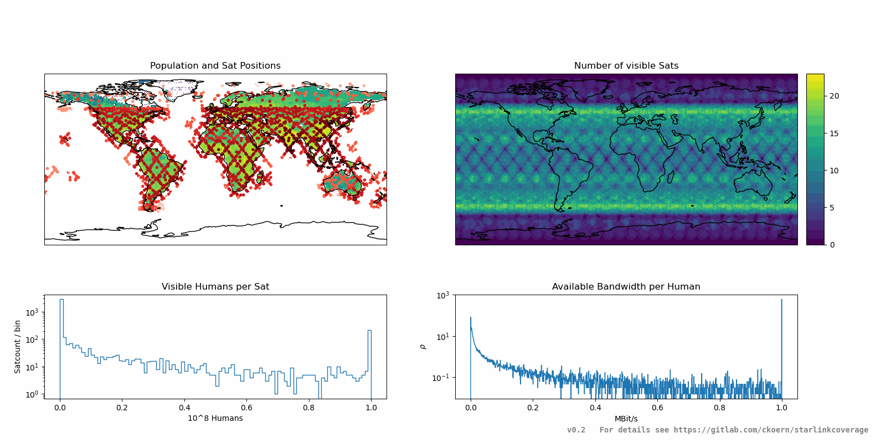

Simulation of the global coverage of the Starlink satelite internet constellation, based on the design of 24 planes with 53 degree inclination and 66 satelites per plane.
For the population data, the Gridded Population of the World estimate for 2020 was used (see [here](https://doi.org/10.7927/H4JW8BX5))

# Limitations
- Solid Angle of satelite coverage is not preserved along different lattitudes! A constant convolution kernel is used along all lattitudes (which is disk-shaped). In a correct implementation, the filter kernel has to be elliptic, since a equirectangular projection is used (see [Wikipedia](https://upload.wikimedia.org/wikipedia/commons/thumb/1/17/Plate_Carr%C3%A9e_with_Tissot%27s_Indicatrices_of_Distortion.svg/1280px-Plate_Carr%C3%A9e_with_Tissot%27s_Indicatrices_of_Distortion.svg.png) ). However, for the inclination of 53 degree, this effect is not so big, but should be implemented in the future to allow the visualization of constellation planes with higher inclinations
- The mean anomaly offset between different planes are set to alternate by half a slot-width on every other plane. This is choosen arbitrarily and might effect the number of visible satelites close to the equator quite significantly
- A Bandwidth of 20GBit/s per satelite is assumed to calcuate the available bandwidth